# refractui

A terminal SQL IDE powered by dbt, with an embedded neovim for editing.

Think DBeaver / DataGrip, but in your terminal — with full vim keybindings, your own neovim
config, and your existing dbt connections. No new credentials, no GUI, no leaving the keyboard.

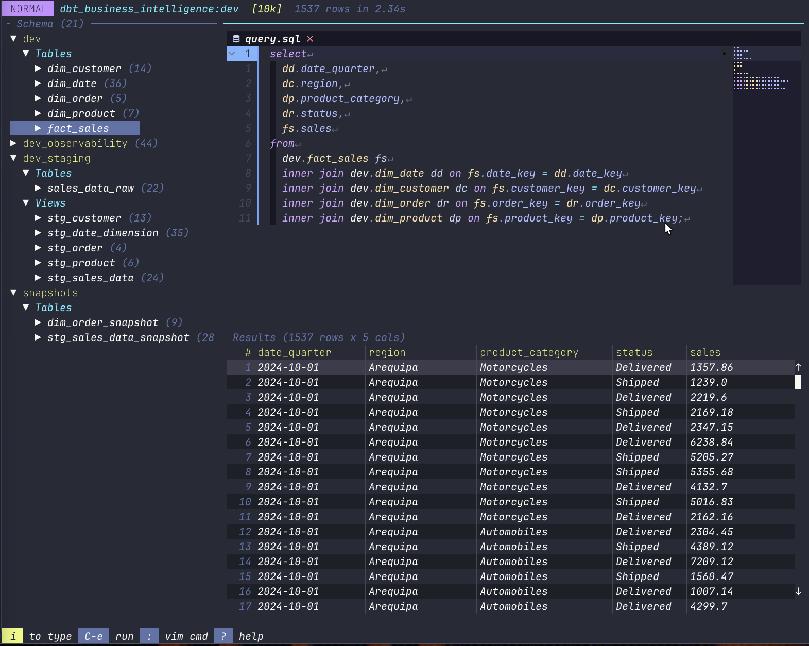

## Quickstart

First time? Here's zero-to-querying.

**1. Install the prerequisites**

- [neovim](https://neovim.io) ≥ 0.8 — the embedded editor
- [uv](https://github.com/astral-sh/uv) — bootstraps refractui's private dbt environment (no global dbt install needed)
- [Rust](https://rustup.rs) — to build and install refractui

**2. Install refractui**

```bash
cargo install --git https://github.com/MiConnell/refractui
```

> Prebuilt binaries and `brew install` arrive with the first tagged release. Until then, install
> from source as above (or clone and run `cargo install --path .`).

**3. Point it at your warehouse**

refractui reads `~/.dbt/profiles.yml`. If you already use dbt, you're done — it reuses those
connections. Otherwise add at least one connection there.

**4. Run it**

```bash
refractui
```

Press `Ctrl-c` to pick a connection, write SQL in the editor pane, and `Ctrl-e` to run. The first
time you use a given warehouse, refractui installs the matching `dbt-<adapter>` into its private
venv automatically.

## Features

- **Real neovim for editing** — `nvim --embed`, so your config, plugins, and muscle memory all work.
- **Uses your dbt connections** — reads `~/.dbt/profiles.yml`; works with any warehouse dbt supports
  (Postgres, Snowflake, BigQuery, Redshift, Databricks, DuckDB, …).
- **Schema explorer** — browse schemas → tables/views → columns; insert names into the editor.
- **Results table** — vim-style navigation, multi-column sort, filter, column hide/resize, and a
  cell inspector (double-click a cell) for long values.
- **Column quick-stats** — right-click a column header for a fast summary of that column.
- **Visualization mode** — turn a result set into a quick bar chart with COUNT / SUM / AVG / MIN / MAX.
- **Command palette** — fuzzy-find every action (`Ctrl-p`).
- **Query history** — a filterable picker (`Ctrl-g`) of past queries per connection. `Enter` re-runs
  the selected query without touching your editor; `Ctrl-o` loads it into the editor (replacing the
  buffer); `Ctrl-a` appends it as a new statement.
- **Cancellable queries** — click the Cancel button while a query runs (with a confirm prompt) to abort it without leaving the app.
- **Copy & export options** — copy to clipboard or export to CSV with your choice of delimiter
  (tab / comma / pipe), header on/off, and which columns to include.
- **Configurable row limit** — pick a preset or enter a custom limit (click the `[10k]` indicator or use the palette).
- **Save / load queries** — keep a library of `.sql` files; your editor buffer also **autosaves and
  restores** across sessions.
- **SQL autocomplete** — schema/table/column names plus SQL keywords (`Ctrl-x Ctrl-o`).
- **SQL formatting** — one keystroke (`Ctrl-f`).
- **Flexible layout** — toggle the explorer/results panes, switch the split between horizontal and
  vertical (`Ctrl-t`), and drag to resize. Full mouse support: click-to-focus, drag splits/columns/
  scrollbars, and scroll-wheel through results.
- **Multi-statement buffers** — separate statements with `;` or `--**--`; the statement under your
  cursor is highlighted so you always see what `Ctrl-e` will run.

## Screenshots

schema explorer

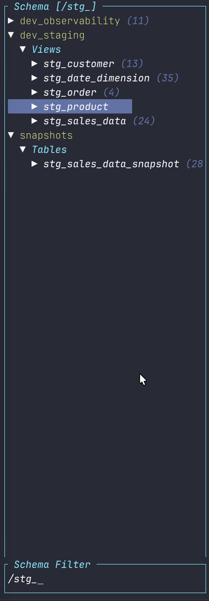

results visualization

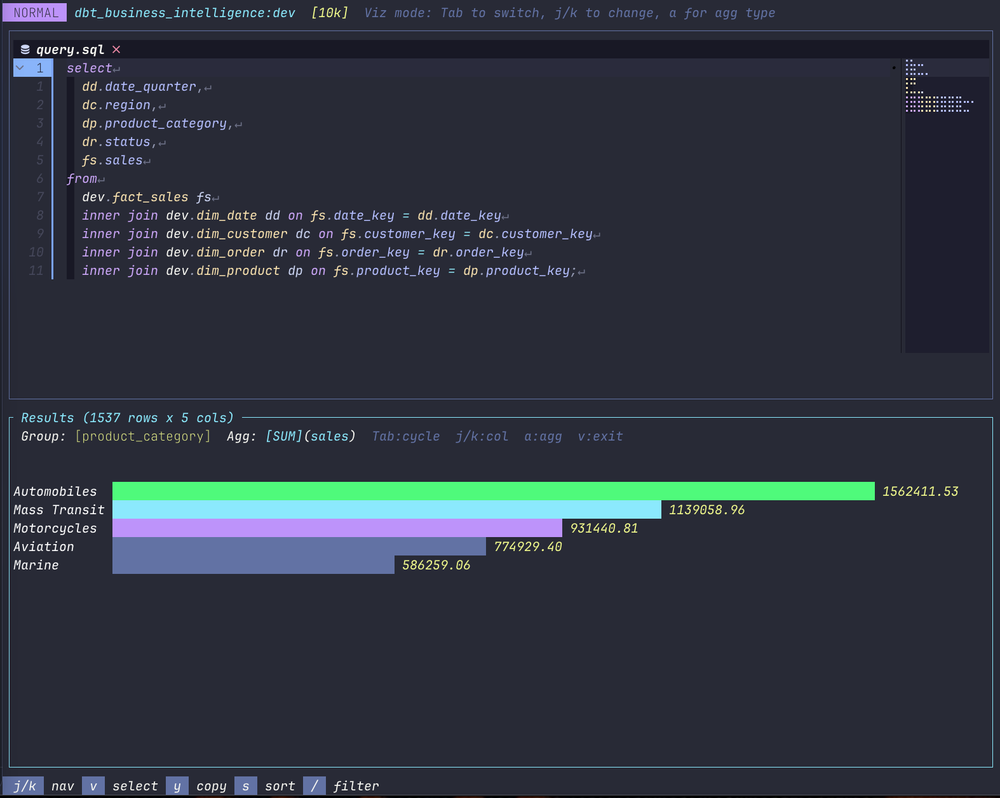

command palette

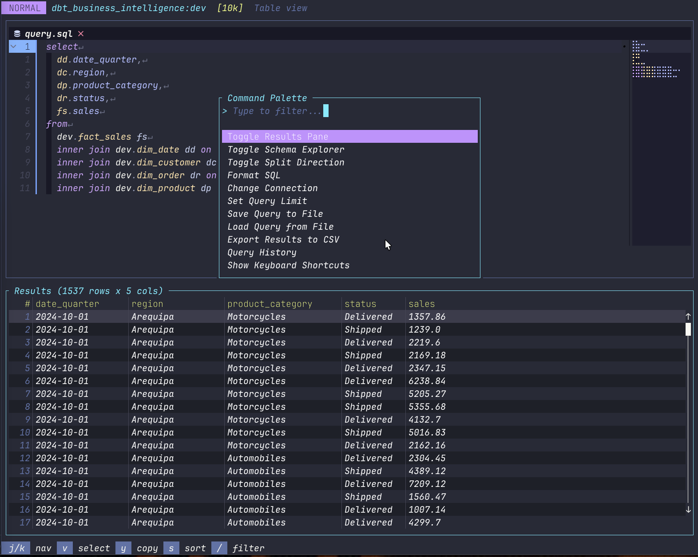

query history

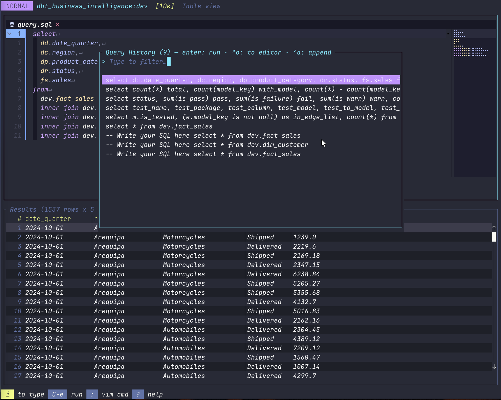

cell inspector

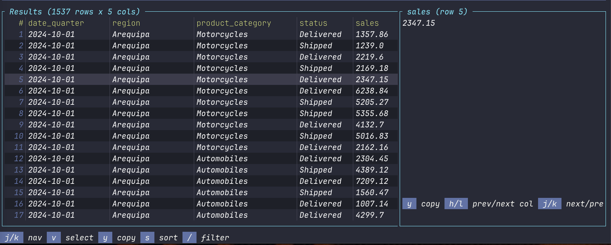

column quick stats

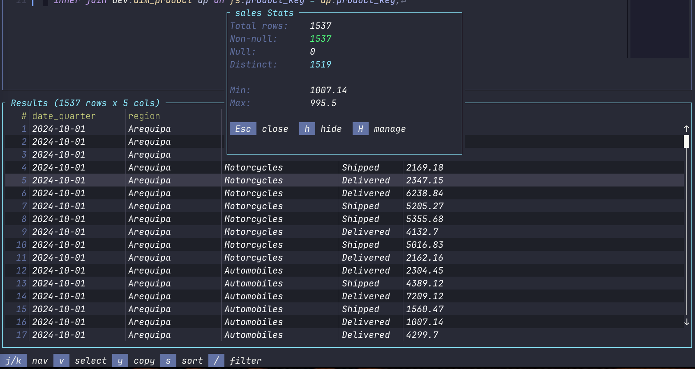

copy options

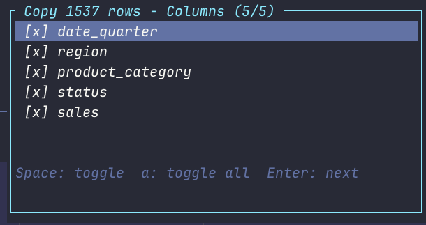
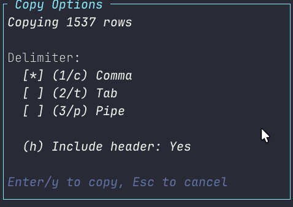

cancel in-flight

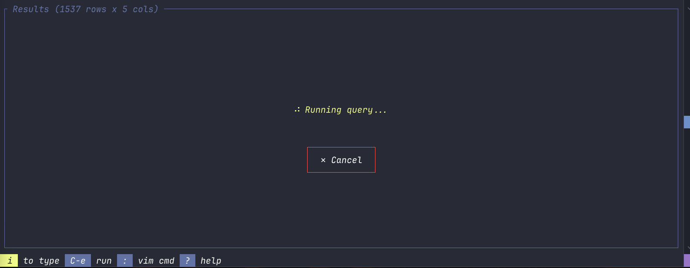

## Requirements

- **neovim** ≥ 0.8 (embedded editor)
- **uv** ([astral.sh/uv](https://github.com/astral-sh/uv)) — used once to bootstrap a private dbt
  environment on first run
- **`~/.dbt/profiles.yml`** with your database connections

You do **not** need a global dbt install — refractui manages its own isolated dbt environment under
`~/.refractui/`.

## Install

```bash
# Run from source
cargo run

# Or install the binary
cargo install --path .
refractui
```

## Usage

1. Launch `refractui`.
2. Press `Ctrl-c` to pick a connection from your `profiles.yml`. On first use for a given adapter,
   refractui installs the matching `dbt-<adapter>` into its private venv (one-time, automatic).
3. Write SQL in the editor pane (it's neovim — edit however you like).
4. Press `Ctrl-e` (or `Ctrl-Enter`) to run. Results appear below.

By default a query runs the statement under your cursor (statements are separated by `;` or a
`--**--` marker). Select text in visual mode to run just the selection, or run the whole buffer if
there's only one statement.

> **Read-only — `SELECT` queries only.** Queries run through `dbt show`, which is built for
> previewing query results, so it returns rows but does not execute DDL or DML. Statements like
> `CREATE` / `ALTER` / `DROP` and `INSERT` / `UPDATE` / `DELETE` are not supported and will error or
> behave unexpectedly. refractui is a tool for exploring data, not changing it.

connections picker
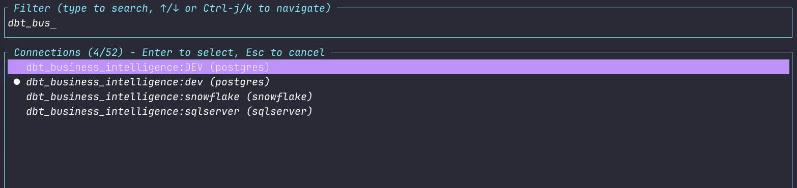

## Keybindings

### Global

| Key | Action |
|-----|--------|
| `Tab` | Switch focus (editor ↔ results ↔ explorer) |
| `Ctrl-c` | Connection picker |
| `Ctrl-e` / `Ctrl-Enter` | Execute query |
| `Ctrl-f` | Format SQL |
| `Ctrl-r` | Toggle results pane |
| `Ctrl-b` | Toggle schema explorer |
| `Ctrl-t` | Toggle split direction (horizontal/vertical) |
| `Ctrl-g` | Query history picker (filter + re-run) |
| `Ctrl-s` / `Ctrl-o` | Save / load query file |
| `Ctrl-x` | Export results to CSV |
| `Ctrl-p` | Command palette (`F1` also works) |
| `?` | Help overlay |
| `Ctrl-q` | Quit |

### Editor (neovim)

All other keys are forwarded to neovim. Plus:

| Key | Action |
|-----|--------|
| `Ctrl-x Ctrl-o` | SQL autocomplete (schema/table/column + keywords) |
| `.` | Trigger completion |

### Results

| Key | Action |
|-----|--------|
| `j` / `k` | Navigate rows |
| `h` / `l` | Scroll horizontally |
| `Ctrl-d` / `Ctrl-u` | Page down / up |
| `gg` / `G` | Jump to first / last row |
| `s` / `S` | Sort picker / clear sort |
| `/` | Filter results |
| `v` | Visual select mode (then `y` / `Y` to copy) |
| `V` | Toggle visualization (chart) mode |
| `H` | Hide/show columns |
| scroll wheel | Scroll results |
| click header | Sort by column |
| right-click header | Column quick-stats |
| double-click cell | Cell inspector |

### Explorer

| Key | Action |
|-----|--------|
| `j` / `k` | Navigate |
| `Enter` / `Space` | Expand / collapse |
| `/` | Filter schema |
| `i` | Insert name into editor |

Mouse is supported throughout: click to focus a pane; drag the split, scrollbars, or column borders
to resize; scroll-wheel through results; click a header to sort, right-click it for column stats;
double-click a cell to inspect it; and click the `[10k]` row-limit indicator to change it. While a
query is running, click **Cancel** to abort it.

## How it works

- **Editing** is a live, embedded neovim instance (via `nvim-rs`). refractui renders neovim's screen
  into the editor pane and forwards your keys to it.
- **Connections** come straight from `~/.dbt/profiles.yml` — the single source of truth. Nothing is
  duplicated in a separate config.
- **Query execution** shells out to `dbt show --inline` against a minimal generated dbt project,
  using the selected profile/target. Output is parsed back into the results table. Because it goes
  through `dbt show`, only read-only `SELECT` queries are supported — no DDL/DML.
- **Isolation**: refractui keeps its own dbt venv and stub project under `~/.refractui/`, and stores
  history, saved queries, and preferences under `~/.config/refractui/`.

### Why dbt as the backend?

- You already have `~/.dbt/profiles.yml` with all your connections.
- dbt adapters cover Postgres, Snowflake, BigQuery, Redshift, Databricks, DuckDB, and more.
- No need to reimplement or duplicate connection management — if dbt can reach it, so can refractui.

## Development

Git hooks live in `.githooks/` and mirror CI so failures are caught before they reach a runner.
Enable them once per clone:

```bash
git config core.hooksPath .githooks
```

- **pre-commit** — `cargo fmt --all --check`
- **pre-push** — `cargo fmt --all --check`, `cargo clippy --all-targets -- -D warnings`, `cargo test`

Bypass with `--no-verify` when needed.

## License

MIT
